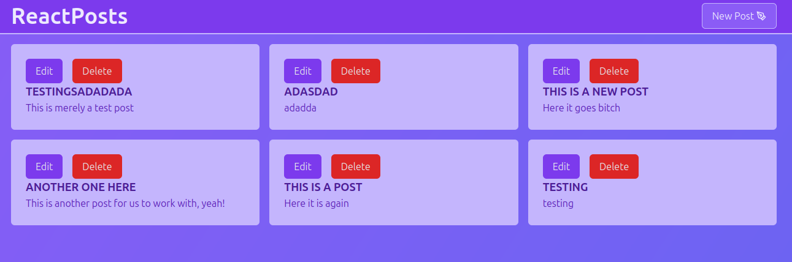

# React Posts

A react and nodejs application built to go over NodeJS, Express, and React concepts.
Had some issues with the database, tried to use sqlite3 at first but had to end up using mysql2.
Had some issues with cors and also with sending data due to content-type header.
I used fetch and not something like axios.

Able to get all posts, create a new post, edit a post, and delete a post.

May add more features in the future.

